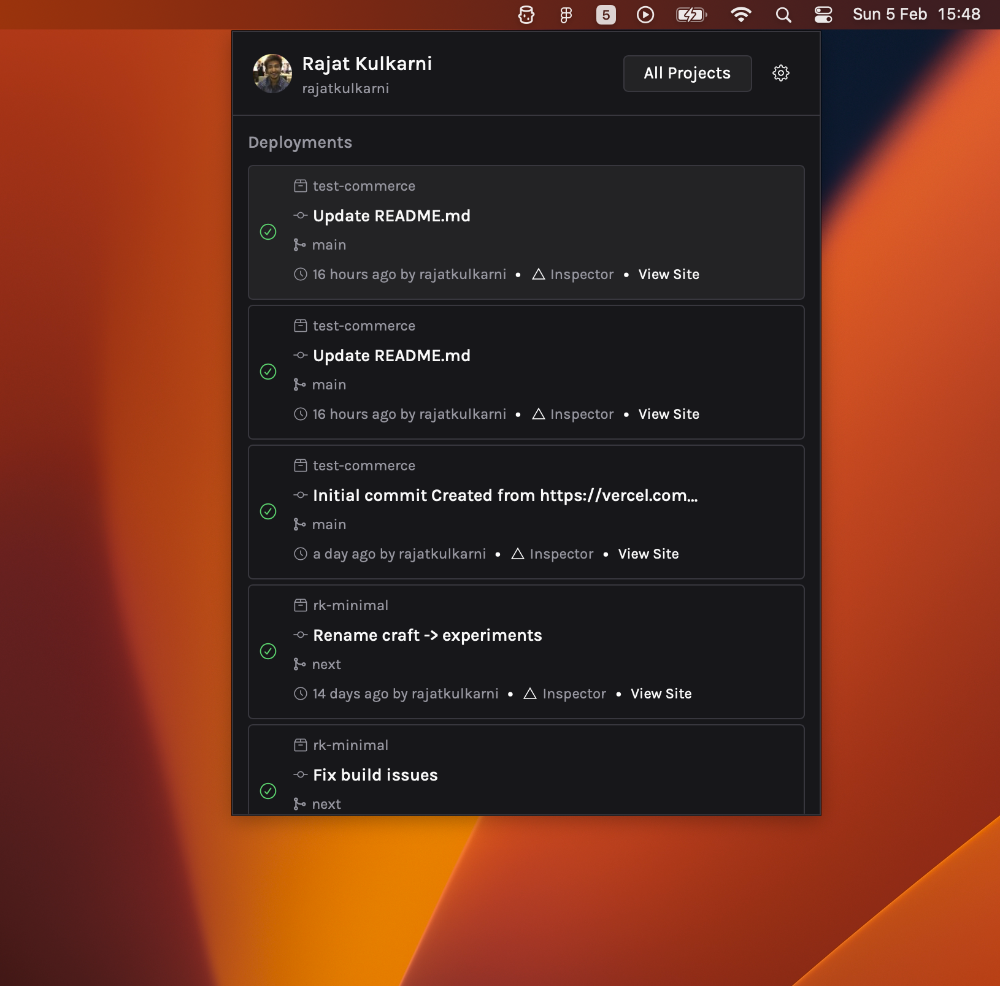

# BuildLog

Quickly look at your Vercel Deployments in you menu bar!

## Building

The app uses Tauri for bundling and creating the tray, while the frontend is written with Nextjs and Typescript.

`yarn dev`

Runs just the Frontend Nextjs site, so you should be able to see it in the browser

`yarn tauri dev`

Makes it into a system tray

`yarn build` and `yarn tauri build`

Build the app for browser and desktop respectively

## FAQs

1.  Where do I get the Personal Access Token?

    Steps for creating a Personal Access Token are listed here https://vercel.com/docs/rest-api#introduction/api-basics/authentication/creating-an-access-token

2.  What does BuildLog do with the Personal Access Token?

    Vercel requires the token to be part of the Authorization Header (to authenticate every request I make). As for what I do with it - **Nothing** (well apart from using it for making said requests). The token is **stored on your device** at all times, and **never leaves it** (I also don't have a server, so don't worry about it)

## Contributing

I'll be more than happy to improve on the app, so feel free to write in issues/improvements that you might want
